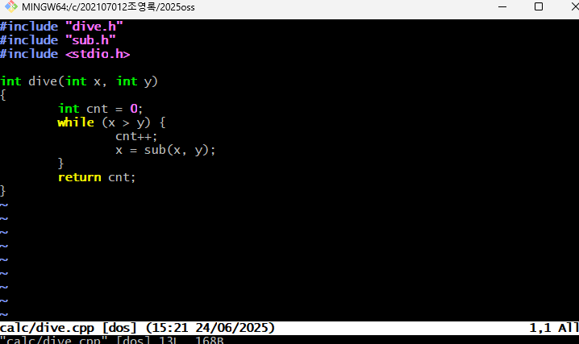
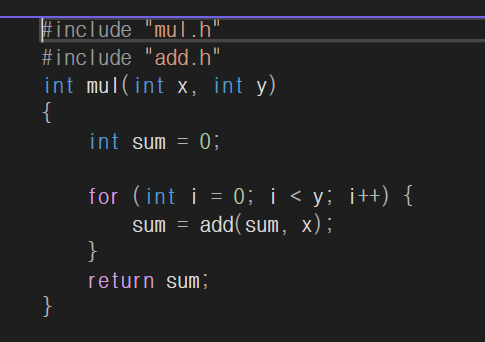
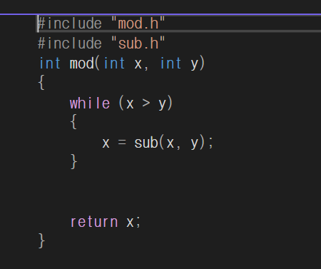
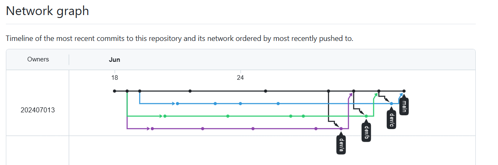

# calc - OSS 기말 프로젝트
> 팀 프로젝트 저장소 : (https://github.com/202407013/2025oss)

> ## 프로젝트 개요
> 간단한 사칙연산 계산기 프로그램 개발 및 Git 브랜치 관리 실습을 목적으로 한 OSS 기말 팀 프로젝트입니다.
>
> ---

> ## 팀 구성 및 역할
> |이름|역할|담당 업무|
> |----|----|---------|
> |최승현(팀장, 202407013)|dev/a,main 브랜치| 브랜치 및 main 병합,충동 해결|
> |김용현(팀원, 202407016)|dev/b 브랜치|기능 개발 및 ReadMe.md작성|
> |조영록(팀원, 202107012)|dev/c 브랜치|기능 개발 |
>
> ---
>
> ## 문제 해결 방법과 병합 순서

> 1.'main' 브랜치와 'dev/a' 브랜치 병합
 
> 2. `main` ↔ `dev/b` 병합 중 충돌 발생
  
> 3. `dev/b`의 내용을 수정하여 **fast-forward 병합**
 
> 4. `dev/c` 브랜치 병합 중 충돌 발생
 
> 5. `dev/c`의 내용을 수정하여 **fast-forward 병합**
 
> 6. 정상 병합 확인 후 실행 및 테스트
 
> 7. 최종 `README.md` 수정
 

---

##개발 및 병합 과정 스크린샷

### 1.코드 및 병합 과정 스크린샷
최승현팀장 calc.cpp, add.cpp, sub.cpp 수정 이미지와 calc.cpp, add.cpp, sub.cpp  

  

  

  

조영록팀원 dive.cpp 수정 이미지와 dive.cpp커밋한 내용  

  

김용현팀원 mul.cpp, mod.cpp 수정 이미지와 mul.cpp, mod.cpp커밋한 내용  

  

  

  

main과 dev/a브랜치 충돌수정 이미지

main과 dev/c브랜치 충돌수정 이미지

git flow 이미지 사진  

계산기코드 출력 화면  

